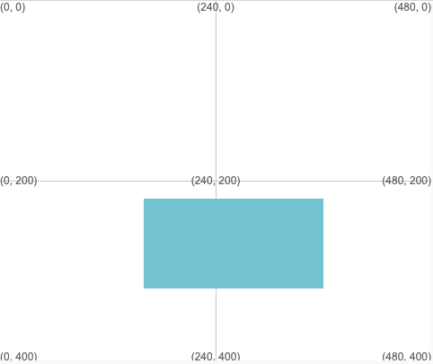

ارسم مربعًا أو مستطيلًا باستخدام: `rect(x, y, الارتفاع, العرض)`

سيتم رسم المستطيل باستخدام حركة سريعة والتعبئة التي تم تعيينها قبل استدعاء `rect`.

--- code ---
---
language: python
filename: main.py
---

  # x ، y ، العرض ، الارتفاع rect(160, 220, 200, 100)

--- /code ---

سيتم رسم المستطيل بحيث تكون الزاوية اليسرى العلوية له عند إحداثيات (x, y) المعطاة بأول رقمين.

**نصيحة:** إذا كنت تريد أن يكون مركز المستطيل عند الإحداثيات (x ، y) ، فأستدعي `rect_mode(CENTER)` في الدالة `setup`.

الرقم الثالث هو العرض والرابع هو ارتفاع المستطيل.

لرسم مربع اجعل العرض والارتفاع متساويين.

