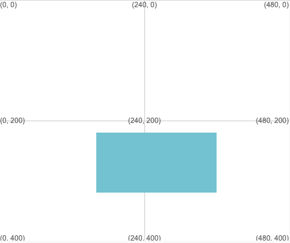

Disegna un quadrato o un rettangolo usando: `rect(x, y, larghezza, altezza)`

Il rettangolo verrà disegnato utilizzando i valori di tratto e riempimento impostati prima che venga chiamata la funzione `rect`.

--- code ---
---
language: python
filename: main.py
---

    rect(160, 220, 200, 100) # x, y, larghezza, altezza

--- /code ---

Il rettangolo verrà disegnato con l'angolo superiore sinistro alle coordinate (x, y) date dai primi due numeri.

**Suggerimento:** Se vuoi che il centro del rettangolo si trovi sulle coordinate (x, y), chiama `rect_mode(CENTER)` nella funzione `setup`.

Il terzo numero è la larghezza e il quarto è l'altezza del rettangolo.

Rendi la larghezza e l'altezza uguali per disegnare un quadrato.

