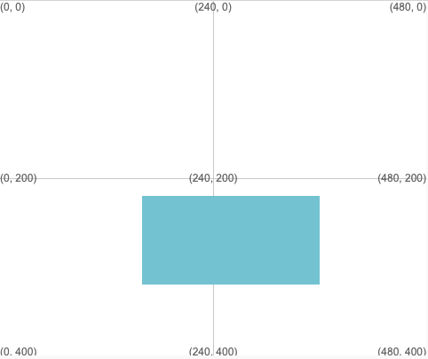

Desenhe um quadrado ou retângulo usando: `rect(x, y, largura, altura)`

The rectangle will be drawn using the stroke and fill values that have been set before `rect` is called.

--- code ---
---
language: python
filename: main.py
---

  rect(160, 220, 200, 100) # x, y, largura, altura

--- /code ---

The rectangle will be drawn with its top left corner at the (x, y) coordinates given by the first two numbers.

**Tip:** If you want the center of the rectangle to be at the (x, y) coordinates then call `rect_mode(CENTER)` in the `setup` function.

O terceiro número é a largura e o quarto é a altura do retângulo.

Faça a mesma largura e altura para desenhar um quadrado.

